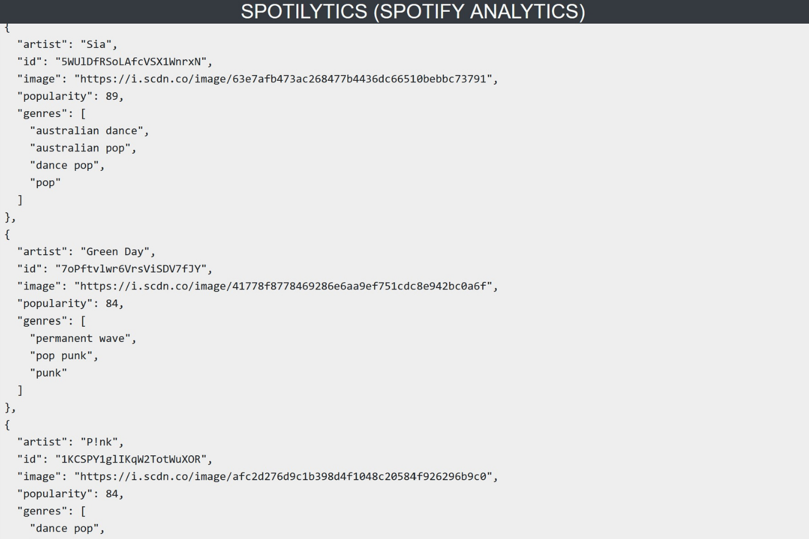
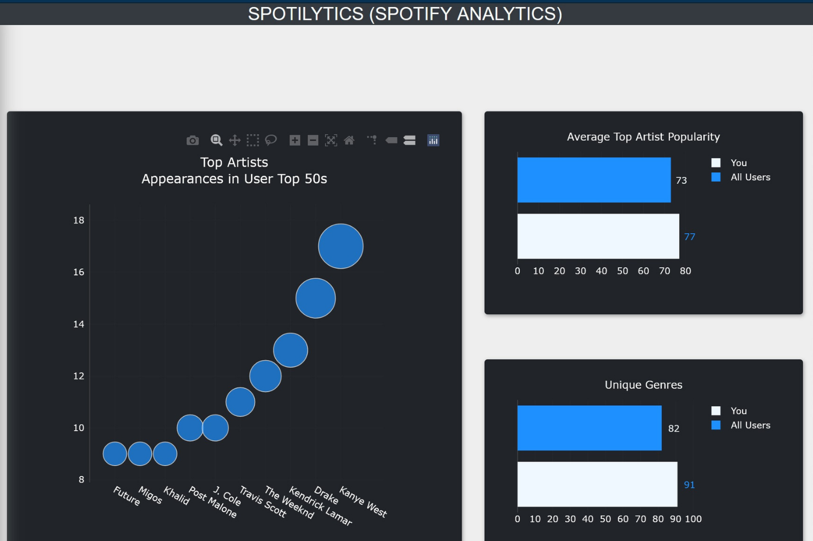
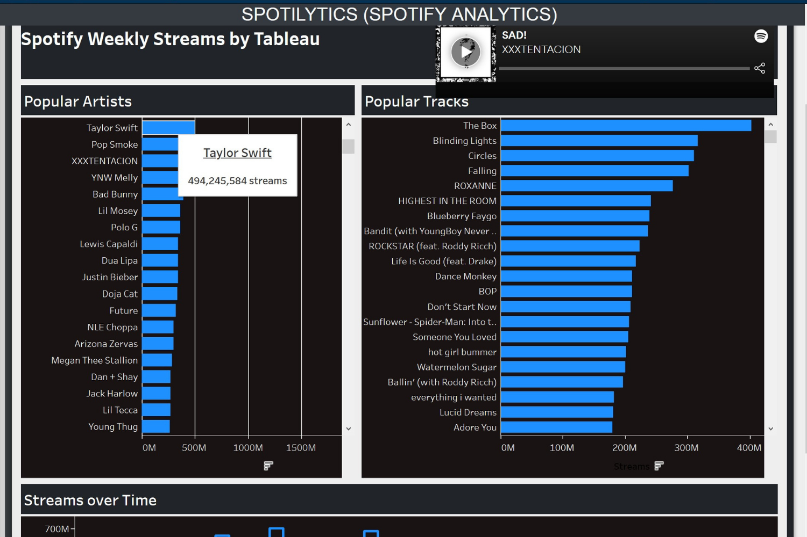

# Spotilytics

## Background

For our final project, our team was tasked to let our minds run wild with ideas.  Although we had certain criteria that a minimum had to be met,  we wanted to throw everything possible that we learned during the six months of our Boot Camp.

Introducing [Spotilytics!](https://spotify-user-music-taste.herokuapp.com)

## Spotify API

A user of Spotify is able to log into our app using their preferred method of login.  From there we were able to work with Spotify's API in order to generate a token in order to caputure information about the user. The following information was captured using this API:

 - User's Top 50 Artists
 - User's Top 50 Songs along with their URIs
 - User name
 - User profile picture

## Mongo DB

All information was then stored in a NoSQL Mongo DB database for futher dissemination.  Links to our Mongo DB were given to populate the charts and graphs on the front page.  Additionally, information about the user was added to previous information already collected, so that each new user helped with the listening comparison page.

## Dashboard and Python Flask App

In order to populate the dashboard properly, we used Python Flask to populate the proper information on the pages.  The Flask app included:

 - A page for the login information
 - A callback to Spotify's API for authorization into the information needed to populate the graph
 - A redirect page to show the information of the user in JSON format
 - The main page of dashboard
 - A comparison of the individual user's listening tastes to all that had signed onto the app up to that point
 - A page for Tableau comparisons
 - A page to serve information about the developers of the app

## Main Page of Dashboard

The main page of the dashboard as partially seen here, consists of a number of components:

 - The profile name and picture associated with the user that logged into the file
 - Top Genre of user
 - Top 50 Artists of the user
 - Top 50 Songs of the user along with an embedded player for each of the 50 songs generated through the Spotify URL of each song
 - Three graphs produced using d3.js
   - A polar clock graph of the audio analysis of the users top 50 songs.  The audio analysis factors in danceability, energy, valence (or happiness) and acousticness
   - A pie chart of the top 10 genres given rom the top 50 artists
   - A stacked bar chart of the audio analysis of each of the top 50 songs 

## JSON Data

To be transparent to each user, we provided all that we captured with Spotify's API back to the user.

## Listening Comparison

The listening comparison page, as seen here consisted of three components:

 - A list of the all the top artists that had used the app to date.
 - The users average artist popularity vs the average artist's popularity across all users of the app
 - The total number of unique genres compared to the average number of unique genres across all users of the app

## Tableau Visualization

For a broader comparison of the top artists and tracks, information was collected from the website <https://spotifycharts.com/regional>.  This chart was based on the webinar Tableau gave back in 2019 found here: <https://www.tableau.com/about/blog/2019/7/how-visualize-spotify-music-trends-tableau>
The Tableau page consisted of four parts:

 - The top artists by number of streams in the past year
 - The top songs by number of streams in the past year
 - A look at each artists or streams over the course of the past year
 - An embedded player that would play the song, if selected using the URI of the song from Spotify.

## Machine Learning

For the Machine learning part, we pulled a dataset from [Kaggle](https://www.kaggle.com/cnic92/spotify-past-decades-songs-50s10s), which contains over 40,000 and their associated audio features.
We used k means clustering to group the songs into different clusters based on their audio features.  Next we split the data into training and testing sets and used the random forest mobdel to predict the group number of each song.
Then we used hyper parameter tuning to find the optimnum number of tress and the trees depth.  We then trained the moel based on the optimum number of trees and dept and based on the users top 50 songs used that to preduct  the song taste of the users and which cluster his tastes fall into.
This gave us a sense of what other songs he might be interested in listening to.

## Developers Page

Flip cards were produced for each of the developers of the app using CSS hover, rotate and transition properties.

The developers of the project are:
 - Sahar Alaei
 - Henry Byoun
 - Derrik Dennis
 - Conor Gleason
 - Ariana Monteiro
 - Maanasa Neralla
 - Peidong Zhao

