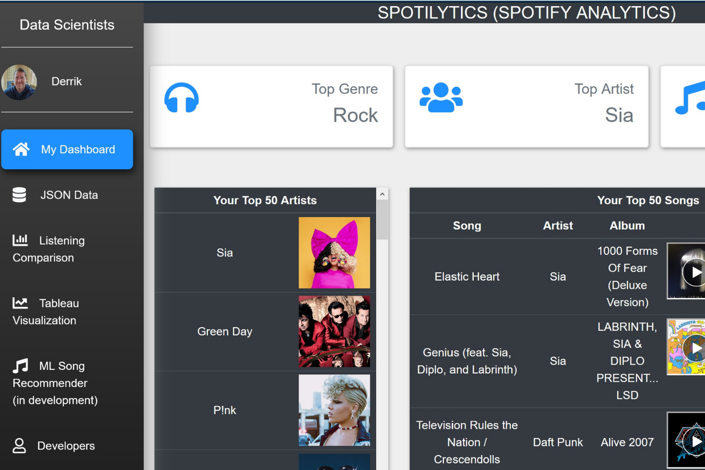

# Spotilytics

## Background

For our final project, our team was tasked to let our minds run wild with ideas.  Although we had certain criteria that a minimum had to be met,  we wanted to throw everything possible that we learned during the six months of our Boot Camp.

Introducing [Spotilytics!](https://spotify-user-music-taste.herokuapp.com)

## Spotify API

A user of Spotify is able to log into our app using their preferred method of login.  From there we were able to work with Spotify's API in order to generate a token in order to caputure information about the user. The following information was captured using this API:

 - User's Top 50 Artists
 - User's Top 50 Songs along with their URIs
 - User name
 - User profile picture

## Mongo DB

All information was then stored in a NoSQL Mongo DB database for futher dissemination.  Links to our Mongo DB were given to populate the charts and graphs on the front page.  Additionally, information about the user was added to previous information already collected, so that each new user helped with the listening comparison page.

## Dashboard and Python Flask App

In order to populate the dashboard properly, we used Python Flask to populate the proper information on the pages.  The Flask app included:

 - A page for the login information
 - A callback to Spotify's API for authorization into the information needed to populate the graph
 - A redirect page to show the information of the user in JSON format
 - The main page of dashboard
 - A comparison of the individual user's listening tastes to all that had signed onto the app up to that point
 - A page for Tableau comparisons
 - A page to serve information about the developers of the app.

## Main Page of Dashboard

The main page of the dashboard as seen here, consists of a number of components:

